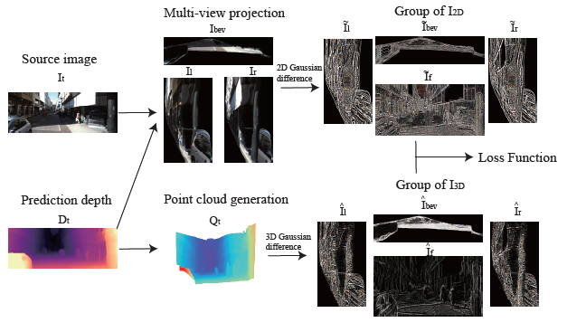
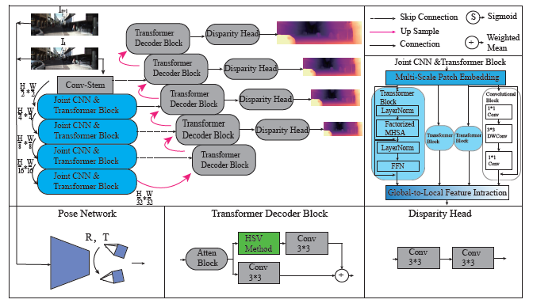
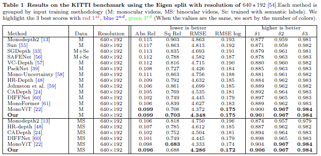
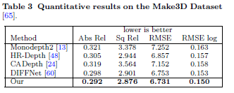

# MonoViT-3D

## ⚙️ Setup

Assuming a fresh [Anaconda](https://www.anaconda.com/download/) distribution, you can install the dependencies with:
```shell
pip3 install torch==1.9.0+cu111 torchvision==0.10.0+cu111 torchaudio==0.9.0
pip install dominate==2.4.0 Pillow==6.1.0 visdom==0.1.8
pip install tensorboardX==1.4 opencv-python  matplotlib scikit-image
pip3 install mmcv-full==1.3.0 mmsegmentation==0.11.0  
pip install timm einops IPython
```
We ran our experiments with PyTorch 1.9.0, CUDA 11.1, Python 3.7 and Ubuntu 18.04.

Note that our code is built based on [Monodepth2](https://github.com/nianticlabs/monodepth2),and[MonoViT](https://github.com/zxcqlf/MonoViT)

## Models

## Results on KITTI

We provide the following options for `--model_name`:

| `--model_name`                                               | Training modality | Pretrained? | Model resolution | Abs Rel | Sq Rel | RMSE  | RMSE log | delta < 1.25 | delta < 1.25^2 | delta < 1.25^3 |
| ------------------------------------------------------------ | ----------------- | ----------- | ---------------- | ------- | ------ | ----- | -------- | ------------ | -------------- | -------------- |
| [`mono_640x192`](https://drive.google.com/drive/folders/1PBzqv8lqacdLNPLFsKrzwTnd8-d__nlR?usp=sharing) | Mono              | Yes         | 640 x 192        | 0.099   | 0.703  | 4.348 | 0.175    | 0.901        | 0.967          | 0.984          |
| [`mono+stereo_640x192`](https://drive.google.com/drive/folders/1i6xRWc3gZ_1uKe1rqWt7KD_xAFSMVSSA?usp=sharing) | Mono + Stereo     | Yes         | 640 x 192        | 0.096   | 0.688  | 4.286 | 0.172    | 0.906        | 0.967          | 0.984          |
| [`mono_1024x320`](https://drive.google.com/drive/folders/140WhmjS4mxh0zggGBL-pavOgd0hkLtX0?usp=sharing) | Mono              | Yes         | 1024 x 320       | 0.095   | 0.691  | 4.243 | 0.171    | 0.909        | 0.969          | 0.984          |
| [`mono+stereo_1024x320`](https://drive.google.com/drive/folders/177D41NpG3Nx5pC2TXTHecFMKPbpTb-ot?usp=sharing) | Mono + Stereo     | Yes         | 1024 x 320       | 0.093   | 0.683  | 4.223 | 0.170    | 0.915        | 0.969          | 0.984          |

## Method





## Results on KITTI and MAKE3D






## 💾 KITTI training data

You can download the entire [raw KITTI dataset](http://www.cvlibs.net/datasets/kitti/raw_data.php) by running:
```shell
wget -i splits/kitti_archives_to_download.txt -P kitti_data/
```
Then unzip with
```shell
cd kitti_data
unzip "*.zip"
cd ..
```
**Warning:** it weighs about **175GB**, so make sure you have enough space to unzip too!

Our default settings expect that you have converted the png images to jpeg with this command, **which also deletes the raw KITTI `.png` files**:
```shell
find kitti_data/ -name '*.png' | parallel 'convert -quality 92 -sampling-factor 2x2,1x1,1x1 {.}.png {.}.jpg && rm {}'
```
**or** you can skip this conversion step and train from raw png files by adding the flag `--png` when training, at the expense of slower load times.

The above conversion command creates images which match our experiments, where KITTI `.png` images were converted to `.jpg` on Ubuntu 16.04 with default chroma subsampling `2x2,1x1,1x1`.
We found that Ubuntu 18.04 defaults to `2x2,2x2,2x2`, which gives different results, hence the explicit parameter in the conversion command.

You can also place the KITTI dataset wherever you like and point towards it with the `--data_path` flag during training and evaluation.

**Splits**

The train/test/validation splits are defined in the `splits/` folder.
By default, the code will train a depth model using [Zhou's subset](https://github.com/tinghuiz/SfMLearner) of the standard Eigen split of KITTI, which is designed for monocular training.
You can also train a model using the new [benchmark split](http://www.cvlibs.net/datasets/kitti/eval_depth.php?benchmark=depth_prediction) or the [odometry split](http://www.cvlibs.net/datasets/kitti/eval_odometry.php) by setting the `--split` flag.


**Custom dataset**

You can train on a custom monocular or stereo dataset by writing a new dataloader class which inherits from `MonoDataset` – see the `KITTIDataset` class in `datasets/kitti_dataset.py` for an example.


## ⏳ Training

PLease download the ImageNet-1K pretrained MPViT [model](https://dl.dropbox.com/s/y3dnmmy8h4npz7a/mpvit_small.pth) to `./ckpt/`.

For training, please download monodepth2, replace the depth network, and revise the setting of the depth network, the optimizer and learning rate according to `trainer_3D.py`. 

Because of the different torch version between MonoViT and Monodepth2, the func `transforms.ColorJitter.get_params` in dataloader should also be revised to `transforms.ColorJitter`.

By default models and tensorboard event files are saved to `./tmp/<model_name>`.
This can be changed with the `--log_dir` flag.

-------

monodepth2/trainer.py，The Depth Model Definition section of the document (lines 54-62) is modified to read：

       # self.models["encoder"] = networks.ResnetEncoder(
        #    self.opt.num_layers, self.opt.weights_init == "pretrained")
        self.models["encoder"] = networks.mpvit_small()
        self.models["encoder"].num_ch_enc = [64,128,216,288,288]
        self.models["encoder"].to(self.device)
        #self.parameters_to_train += list(self.models["encoder"].parameters())
     
        self.models["depth"] = networks.DepthDecoder(
            self.models["encoder"].num_ch_enc, self.opt.scales)
        self.models["depth"].to(self.device)
        self.parameters_to_train += list(self.models["depth"].parameters())
Change the optimizer section (lines 102-104) to read：

        self.params = [ {
            "params":self.parameters_to_train, 
            "lr": self.opt.learning_rate
            #"weight_decay": 0.01
            },
            {
            "params": list(self.models["encoder"].parameters()), 
           "lr": self.opt.learning_rate/2
            #"weight_decay": 0.01
            } ]
        self.model_optimizer = optim.AdamW(self.params)
        self.model_lr_scheduler = optim.lr_scheduler.ExponentialLR(
    	self.model_optimizer,0.9)
Modifying a function

```
F.grid_sample(inputs[("color", frame_id, source_scale)],
                    outputs[("sample", frame_id, scale)],
                    padding_mode="border", align_corners=True)
```

-----

Then, use this GitHub code to replace the python file.

**Monocular training:**

```shell
python trainer_3D.py --model_name mono_model --learning_rate 5e-5
```

**Monocular + stereo training:**
```shell
python trainer_3D.py --model_name mono+stereo_model --use_stereo --learning_rate 5e-5
```

## 📊 KITTI evaluation

To prepare the ground truth depth maps, please follow the monodepth2.

...assuming that you have placed the KITTI dataset in the default location of `./kitti_data/`.

The following example command evaluates the epoch 19 weights of a model named `mono_model` (Note that please use `evaluate_depth.py` for 640x192 models and `evaluate_hr_depth.py --height 320/384 --width 1024/1280` for the others):
```shell
python evaluate_depth.py --load_weights_folder ./tmp/mono_model/models/weights_19/ --eval_mono
```

An additional parameter `--eval_split` can be set.
The three different values possible for `eval_split` are explained here:

| `--eval_split`        | Test set size | For models trained with... | Description  |
|-----------------------|---------------|----------------------------|--------------|
| **`eigen`**           | 697           | `--split eigen_zhou` (default) or `--split eigen_full` | The standard Eigen test files |
| **`eigen_benchmark`** | 652           | `--split eigen_zhou` (default) or `--split eigen_full`  | Evaluate with the improved ground truth from the [new KITTI depth benchmark](http://www.cvlibs.net/datasets/kitti/eval_depth.php?benchmark=depth_prediction) |
| **`benchmark`**       | 500           | `--split benchmark`        | The [new KITTI depth benchmark](http://www.cvlibs.net/datasets/kitti/eval_depth.php?benchmark=depth_prediction) test files. |

## MAKE 3D evaluation

Use the test_make_3D.py

## Acknowledgement
Thanks the authors for their works:
[MonoViT](https://github.com/zxcqlf/MonoViT)
[Monodepth2](https://github.com/nianticlabs/monodepth2)

[MPVIT](https://github.com/youngwanLEE/MPViT)

[HR-Depth](https://github.com/shawLyu/HR-Depth)

[DIFFNet](https://github.com/brandleyzhou/DIFFNet)
